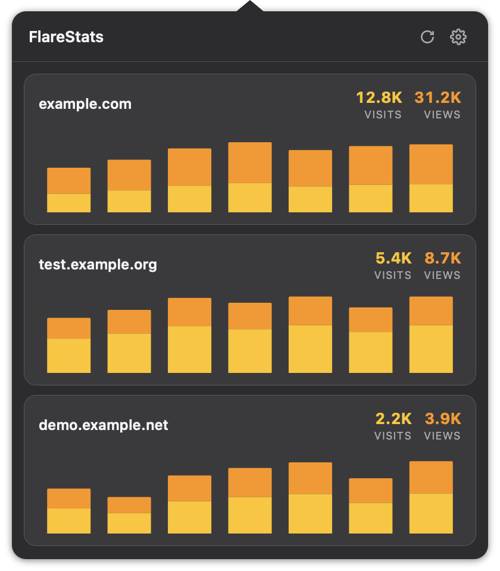
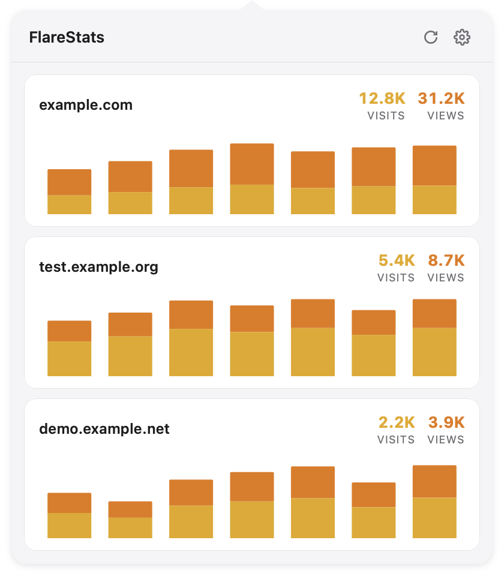

# FlareStats

A macOS menu bar app for monitoring Cloudflare Web Analytics across all your sites. Built with [Tauri 2](https://tauri.app/) + TypeScript + Rust.

## Screenshots

<p align="center">
  
  
</p>

## Features

- Lives in the menu bar — click the tray icon to view analytics
- Shows visits, page views, and traffic charts for each site
- Supports 24h / 7d / 30d time periods
- Bot traffic filtering
- Auto-refreshes on window focus
- Dark mode support

## Prerequisites

- [Node.js](https://nodejs.org/) (v18+)
- [Rust](https://www.rust-lang.org/tools/install)
- Tauri 2 system dependencies — see [Tauri prerequisites](https://v2.tauri.app/start/prerequisites/)
- A Cloudflare API token with `Account Analytics`, `Account Settings` read permissions

## Setup

```bash
npm install
```

## Development

```bash
npm run tauri dev
```

## Build

```bash
npm run tauri build
```

The built `.app` bundle will be in `src-tauri/target/release/bundle/`.

## Tests

```bash
# Rust unit tests
cargo test --manifest-path src-tauri/Cargo.toml

# TypeScript unit tests
npm test
```

## Configuration

On first launch the app opens the settings panel. You need:

1. **API Token** — create one at [Cloudflare Dashboard → API Tokens](https://dash.cloudflare.com/profile/api-tokens) with `Account Analytics`, `Account Settings` read permissions
2. **Account ID** — found on your Cloudflare dashboard overview page

## Project Structure

```
├── src/                  # Frontend (TypeScript + CSS)
│   ├── main.ts           # App entry point, UI rendering, charts
│   ├── utils.ts          # Pure utility functions
│   ├── utils.test.ts     # Vitest tests
│   └── styles.css        # Styles
├── src-tauri/            # Backend (Rust)
│   ├── src/
│   │   ├── commands.rs   # Tauri commands, API calls, business logic
│   │   ├── lib.rs        # Plugin setup
│   │   └── main.rs       # Entry point
│   ├── icons/            # App & tray icons
│   ├── Cargo.toml
│   └── tauri.conf.json
├── index.html
├── package.json
├── tsconfig.json
└── vite.config.ts
```

## License

MIT
